# 🚀 Data Pipeline with Kafka-Spark-Hudi-Polaris

[](https://www.python.org/downloads/)
[](https://kafka.apache.org/)
[](https://spark.apache.org/)
[](https://hudi.apache.org/)
[](https://opensource.org/licenses/MIT)

A **production-ready, real-time streaming data pipeline** that processes multiple data streams through Apache Kafka, transforms them with Apache Spark Streaming, and stores them in Apache Hudi format with Polaris catalog integration for seamless Snowflake connectivity.

### 🔄 Data Flow
1. **Data Sources** → Generate events (user actions, transactions, sensors, logs)
2. **Apache Kafka** → Ingests and distributes data across topics
3. **Spark Streaming** → Processes data in real-time with transformations
4. **Apache Hudi** → Stores data with ACID transactions and versioning
5. **S3 Storage** → Scalable object storage for data lake
6. **Polaris Catalog** → Metadata management for table discovery
7. **Snowflake/DuckDB** → Analytics and querying layer

## 🏗️ Architecture

```mermaid
flowchart TD
    A["📊 Data Sources"] --> B["🔄 Apache Kafka"]
    B --> C["⚡ Spark Streaming"]
    C --> D["🗄️ Apache Hudi"]
    D --> E["☁️ S3 Storage"]
    E --> F["📋 Polaris Catalog"]
    F --> G["❄️ Snowflake/DuckDB"]
    
    H["🎛️ Streamlit UI"] --> B
    
    subgraph Topics ["📨 Data Topics"]
        J["👤 user_events"]
        K["💳 transactions"]
        L["🌡️ sensor_data"]
        M["📝 log_events"]
        N["📦 bulk_upload"]
    end
    
    Topics --> B
    
    I["📈 Monitoring<br/>Prometheus + Grafana"]
    B -.-> I
    C -.-> I
    D -.-> I
    
    style A fill:#e1f5fe
    style B fill:#f3e5f5
    style C fill:#fff3e0
    style D fill:#e8f5e8
    style E fill:#fff8e1
    style F fill:#f1f8e9
    style G fill:#e3f2fd
    style I fill:#fff3e0
```



## ✨ Key Features

### 🔄 Real-Time Processing
- **Infinite Streaming**: Spark Streaming jobs run continuously, never-ending
- **Multi-Topic Support**: Processes 5 different data types simultaneously
- **Auto-Recovery**: Handles failures and continues processing
- **Exactly-Once Semantics**: Ensures data consistency

### 📊 Data Topics Supported
1. **user_events** - User interactions and behavior data
2. **transactions** - Financial transaction records
3. **sensor_data** - IoT sensor readings and telemetry
4. **log_events** - Application and system logs
5. **bulk_upload** - Large batch data imports

### 🏪 Storage & Catalog
- **Apache Hudi**: ACID transactions, time-travel queries
- **Polaris Catalog**: Snowflake-compatible metadata management
- **S3 Compatible**: Works with AWS S3 or LocalStack
- **Partitioned Storage**: Optimized for query performance

### 🎯 Production Ready
- **Docker Compose**: Complete infrastructure setup
- **Monitoring**: Prometheus + Grafana dashboards
- **Health Checks**: Service monitoring and alerting
- **Scalable**: Horizontal scaling support

## 🚀 Quick Start

### Prerequisites
- Python 3.9+, Docker & Docker Compose, Java 11+
- 8GB+ RAM recommended

### 1. Setup
```bash
git clone <repository-url>
cd Data-Pipeline-with-Kafka-Spark-Hudi-Polaris
pip install -r requirements.txt
```

### 2. Start Pipeline
```bash
# Start infrastructure
docker-compose up -d
bash scripts/wait-for-services.sh

# Test with sample data
python examples/quick_start_example.py

# Start real-time processing
python src/streaming/spark_streaming_processor.py
```

### 3. Access UIs
- **Kafka UI**: http://localhost:8080
- **Grafana**: http://localhost:3000 (admin/admin)
- **DuckDB UI**: http://localhost:5000
- **Streamlit**: http://localhost:8501

📖 **Detailed Setup**: See [LOCAL_SETUP.md](LOCAL_SETUP.md) for local development
🚀 **Production Deployment**: See [PRODUCTION_DEPLOYMENT.md](PRODUCTION_DEPLOYMENT.md) for AWS setup

## 📊 Monitoring & Observability

### Service URLs
- **Kafka UI**: http://localhost:8080 - Monitor topics and messages
- **Spark UI**: http://localhost:4040 - Monitor streaming jobs (when running)
- **Grafana**: http://localhost:3000 - Dashboards (admin/admin)
- **Prometheus**: http://localhost:9090 - Metrics collection
- **Streamlit**: http://localhost:8501 - Data input interface

### Quick Monitoring Test
```bash
# 1. Start services
docker-compose up -d && bash scripts/wait-for-services.sh

# 2. Deploy Grafana dashboard
bash scripts/deploy_grafana_dashboard.sh

# 3. Start pipeline and generate data
python src/streaming/spark_streaming_processor.py &
python scripts/benchmark_pipeline.py --messages 5000

# 4. View metrics at http://localhost:3000
```

📊 **Monitoring Guide**: See [MONITORING_QUICKSTART.md](MONITORING_QUICKSTART.md) for detailed testing

### Key Metrics
- **Throughput**: Messages processed per second
- **Latency**: End-to-end processing time
- **Error Rate**: Failed message percentage
- **Consumer Lag**: Pipeline health indicator
- **Storage Growth**: Hudi table sizes

## 🔧 Configuration

The pipeline works out-of-the-box with default settings. For customization:

```bash
cp .env.example .env
# Edit .env file as needed
```

Key configurations:
- **Kafka**: localhost:9092
- **S3 Storage**: LocalStack (localhost:4566)
- **Monitoring**: Prometheus + Grafana
- **Processing**: 10-second batch intervals

### Topic Schemas
Each topic has a predefined schema for data validation:

```python
# user_events
{
    "user_id": "string",
    "event_type": "string", 
    "timestamp": "timestamp",
    "properties": "json"
}

# transactions
{
    "transaction_id": "string",
    "user_id": "string",
    "amount": "decimal",
    "currency": "string",
    "timestamp": "timestamp"
}

# sensor_data
{
    "sensor_id": "string",
    "location": "string",
    "temperature": "float",
    "humidity": "float",
    "timestamp": "timestamp"
}

# log_events
{
    "log_level": "string",
    "message": "string",
    "service": "string",
    "timestamp": "timestamp"
}

# bulk_upload
{
    "batch_id": "string",
    "record_count": "integer",
    "data_type": "string",
    "timestamp": "timestamp"
}
```

## 🏭 Production Deployment

For production environments:
- **AWS MSK** - Managed Kafka with auto-scaling
- **Amazon EMR** - Spark cluster with YARN
- **Amazon S3** - Durable storage with lifecycle policies
- **CloudWatch** - Monitoring and alerting
- **IAM & KMS** - Security and encryption

📘 **Complete Guide**: [PRODUCTION_DEPLOYMENT.md](PRODUCTION_DEPLOYMENT.md)

## 🧪 Testing

```bash
# Unit tests (data validation, schemas, config)
pytest tests/unit/ -v

# Integration tests (Kafka connectivity)
pytest tests/integration/ -v

# All tests with coverage report
pytest tests/ -v --cov=src --cov-report=html

# End-to-end test
python examples/quick_start_example.py

# Performance benchmark
python scripts/benchmark_pipeline.py --messages 10000
```

## 📈 Performance Tuning

### Spark Optimization
- **Batch Duration**: Adjust based on data volume (default: 10s)
- **Parallelism**: Scale with available cores
- **Memory**: Configure executor memory for large datasets
- **Checkpointing**: Enabled by default for fault tolerance

### Hudi Optimization
- **Compaction**: Schedule regular compaction for better read performance
- **Clustering**: Enable for better query performance
- **Indexing**: Uses bloom filters by default

## 🔧 Troubleshooting

**Services not starting**: `docker-compose down && docker-compose up -d`

**Kafka issues**: `docker exec kafka kafka-topics --list --bootstrap-server localhost:9092`

**Port conflicts**: Modify ports in `docker-compose.yml`

See [LOCAL_SETUP.md](LOCAL_SETUP.md) for detailed troubleshooting.

## 🤝 Contributing

1. Fork the repository
2. Create a feature branch (`git checkout -b feature/amazing-feature`)
3. Commit your changes (`git commit -m 'Add amazing feature'`)
4. Push to the branch (`git push origin feature/amazing-feature`)
5. Open a Pull Request

## 📄 License

This project is licensed under the MIT License - see the [LICENSE](LICENSE) file for details.

## 🙏 Acknowledgments

- **Apache Kafka** - Distributed streaming platform
- **Apache Spark** - Unified analytics engine
- **Apache Hudi** - Transactional data lake platform
- **Polaris** - Open source catalog for Apache Iceberg
- **LocalStack** - Local AWS cloud stack
- **DuckDB** - In-process analytical database

## 📞 Support

- 📖 **Local Setup**: [LOCAL_SETUP.md](LOCAL_SETUP.md) - Development environment guide
- 🚀 **Production**: [PRODUCTION_DEPLOYMENT.md](PRODUCTION_DEPLOYMENT.md) - AWS deployment guide
- 🏗️ **Architecture**: [ARCHITECTURE.md](ARCHITECTURE.md) - System design details
- 🤝 **Contributing**: [CONTRIBUTING.md](CONTRIBUTING.md) - Contribution guidelines
- 🐛 **Issues**: GitHub Issues for bugs and features
- 💬 **Questions**: GitHub Discussions

---

⭐ **Star this repository if it helped you build amazing data pipelines!**